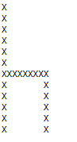

# Chapter 1 Intro to C++

Go to Code Academy Sign up for C++ Courses<a href="https://www.codecademy.com/learn/learn-c-plus-plus">Click Here</a> 
As you work through CodeAcademy website you should be able to do the following challenges.

Using the C++ shell website below complete the following assignment and screen shot your code and the results.  
If you do not know how to screen shot click the link below that takes you to Google and look it up. 

1) Create a statement that says "Hello World" using the C++ shell website listed below 
2) Create a program using the C++ shell site that creates an image of a chair. It should look something like the image attached.  
3) Create a program using the C++ shell site that creates an image of a chair. It should look something like the image  attached but the chair should face the opposite direction. Screen shot your answer and attach it here. 

