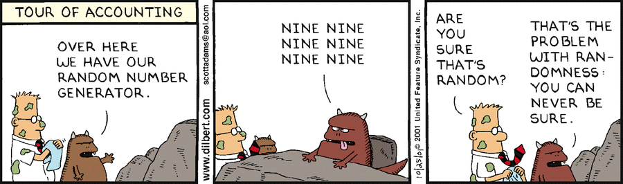

# Chapter-6

<a href="http://www.tutorialspoint.com/cplusplus/cpp_for_loop.htm">For Loop Tutorial</a>

<a href="https://sites.google.com/a/davenport.k12.ia.us/mr-brosius-class-room/c-programming/chapter-6/help-video">Help Video</a>

4.1) Create a random number generator 1 to 10

4.2) Create a game that has the user guess what the number is higher or lower. 

4.3) Create a countdown from 10 to 1 and then say in the output liftoff!. C++ Shell More help here is the video. 

4.4) Create a game that creates a random number generator between the numbers 1 to 100. The user is to input a guess and the response will be if the number is higher or lower. The game will count the number of responses. The user will play the game five times accumulating the total number of responses. At the end of the program it will ask if the user wants to play again yes or no. You will need an IPO chart to complete the game.  

4.5) Building off of the random number generator game you just built. Use switch statements to create 3 different levels for your game easy, medium, and hard. Each level will take you to a more challenging version.
The game must keep track of how many guesses you have had. 
Each time you play it you must be in a for loop that makes you play it 5 times. 

Enrichment: Create a password option that takes to to a special portion of the game and it can be your chose. 

4.6) Enrichment from 4.5 If you guess the amount of guesses is below a certain total, make the game go to a special bonus round.

4.7) 
1. What kinds of things would be difficult to program without loops?
2. What are the advantages and disadvantages of switch statements?
3.When should you use a while loop over a do loop?
4. Describe your favorite game in terms of the game loop. Is the game loop a good fit?

4.8) Switch roles for random number game, the player picks a number and the computer tries to solve it.

4.9) Display a random number through  a for loop. Have the number should display 10 times.

5.0) Turn to page 203 complete number 17 in your book. Modify it to ask the user what currency they want to exchange from US dollar. 

5.1) Rock Paper Scissors. Create a game where the user inputs one of three variables and the computer randomly generates one of the three as well. Display winner, loser, or tie.
Ask the user if they would like to play again and display the record for the user and the computer. 

You need a flow chart to correspond with 5.1 program to be displayed in portfolio.
